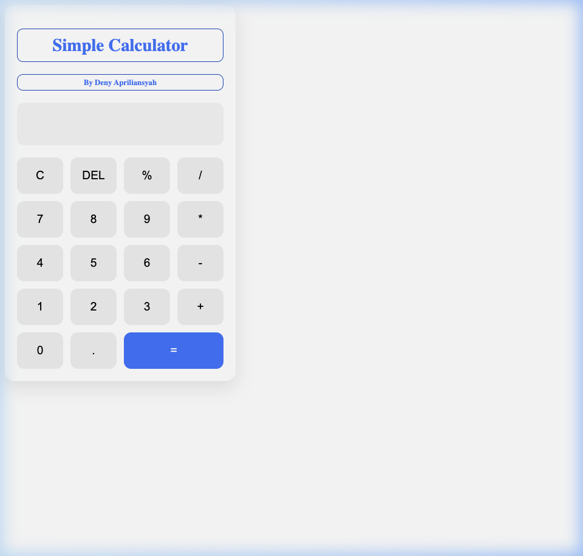

# 🧮 Simple Calculator

Kalkulator sederhana berbasis web yang dibangun dengan HTML, CSS, dan JavaScript — ditenagai oleh **Vite** sebagai build tool.

## 📸 Tampilan UI



## ✨ Fitur

- ➕ Operasi dasar: penjumlahan, pengurangan, perkalian, pembagian
- 🔢 Dukungan angka desimal
- 🔁 Tombol **DEL** untuk hapus karakter terakhir
- 🗑️ Tombol **C** untuk reset tampilan
- 📐 Tombol **%** untuk operasi modulo
- ⚡ Hot reload dengan Vite dev server

## 🗂️ Struktur Project

```
calculator-simple/
├── index.html      # Markup utama
├── style.css       # Styling kalkulator
├── script.js       # Logika kalkulator
├── screenshot.png  # Screenshot UI
└── package.json    # Konfigurasi project & Vite
```

## 🚀 Cara Menjalankan

### Prasyarat
- [Node.js](https://nodejs.org/) v18 atau lebih baru

### Instalasi & Jalankan

```bash
# Clone repository
git clone https://github.com/username/calculator-simple.git
cd calculator-simple

# Install dependensi
npm install

# Jalankan dev server
npm run dev
```

Buka browser di **http://localhost:5173/**

### Build untuk Production

```bash
npm run build    # Build ke folder dist/
npm run preview  # Preview hasil build
```

## 🛠️ Teknologi

| Teknologi | Keterangan |
|-----------|------------|
| HTML5 | Struktur halaman |
| CSS3 | Styling & layout |
| JavaScript (ES Module) | Logika kalkulator |
| [Vite](https://vite.dev/) | Build tool & dev server |

## 👤 Author

**Deny Apriliansyah**

---

> Dibuat sebagai proyek latihan pengembangan web.
